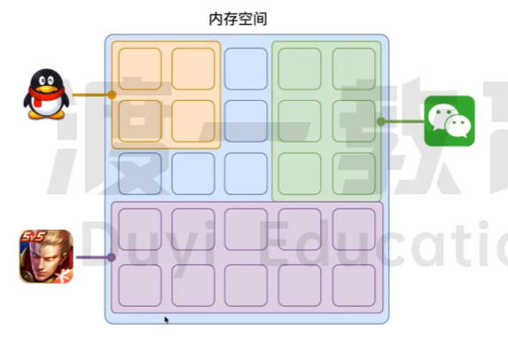

# 事件循环

## 浏览器的进程模型
### 何为进程?
程序运行需要有它自己专属的内存空间，可以把这块内存空间简单的理解为进程。

每个应用至少有一个进程，进程之间相互独立，即使要通信，也需要双方同意。

### 何为线程?
有了进程后，就可以运行程序的代码了。I
运行代码的人称之为线程。
一个进程至少有一个线程，所以在进程开启后会自动创建一个线程来运行代码，该线程称之为主线程如果程序需要同时执行多块代码，主线程就会启动更多的线程来执行代码，所以一个进程中可以包含多个线程。